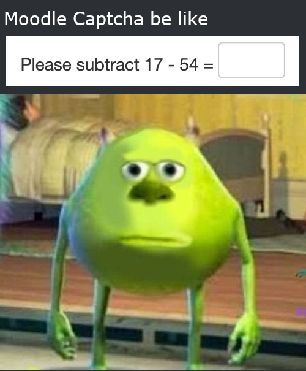

# Moodle Captcha Solver

This is a small chrome extension to autosolve the moodle captchas. To use it, 
clone the repository and change the `matches` attribute in `manifest.json` to 
your insititute moodle URL (my insti is the default). Then, load an unpacked 
extension

~If you're from my institute, check out the Builds section for a prebuilt 
package that you can load into chrome~ This doesn't work as Chrome only allows
extensions listed on the chrome app store. Oh well, just clone the repository,
turn on developer mode and load the unpacked extension.
